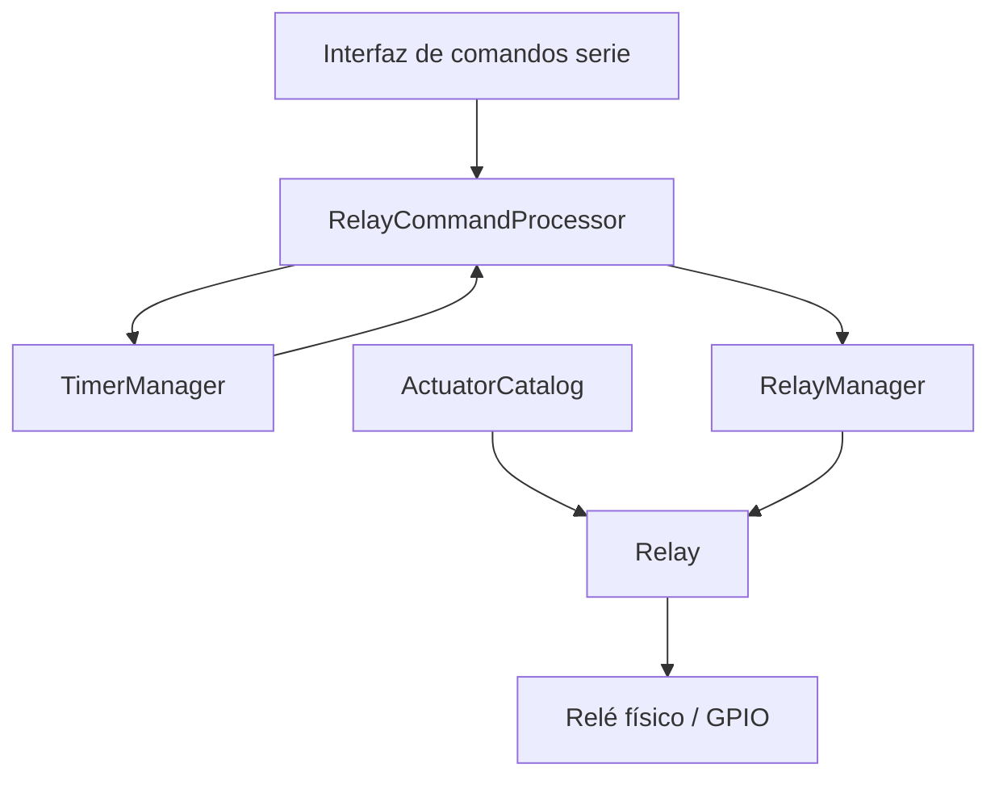

<p align="right">
  <a href="./README.md">English</a> | <strong>Español</strong>
</p>

<p align="center">
  
</p>

<div align="center">

# Automatización de relés con ESP32

### Sistema modular de control de relés desarrollado con C++ y PlatformIO

<p align="center">
  
  
  
  
</p>

</div>

---

## Descripción

Este proyecto implementa un subsistema modular para controlar relés dentro de un **sistema de automatización hidropónica basado en ESP32**.

El firmware está desarrollado en C++ orientado a objetos y separa el comportamiento de los relés, las protecciones, los temporizadores, el procesamiento de comandos y la configuración de actuadores en componentes independientes. Su objetivo es proporcionar una base confiable para integrar posteriormente sensores, horarios, reglas de automatización, configuración persistente, Wi-Fi y una API REST.

La implementación actual controla cuatro actuadores:

| ID | Actuador | GPIO |
|---:|---|---:|
| 1 | Bomba de agua | 16 |
| 2 | Extractor | 17 |
| 3 | Luz | 18 |
| 4 | Humidificador | 19 |

---

## Funcionalidades principales

- Abstracción de relés mediante objetos
- Administración centralizada de relés
- Estado seguro durante el arranque
- Compatibilidad con módulos de relés activos en nivel bajo
- Encendido y apagado manual
- Activaciones temporizadas
- Finalización automática de temporizadores
- Bloqueo y desbloqueo manual
- Protección por tiempo mínimo de apagado
- Protección por tiempo máximo de encendido
- Validación de comandos y códigos de resultado estructurados
- Validación del origen de control
- Interfaz de comandos por puerto serie
- Visualización del estado de relés y temporizadores
- Capacidad preparada para un máximo de 16 relés

---

## Diseño orientado a la seguridad

El sistema evita la manipulación directa y descontrolada de los GPIO.

Cada orden atraviesa una capa de validación antes de llegar al relé físico. Dependiendo de la configuración del actuador, el firmware puede rechazar órdenes por:

- Relé deshabilitado o no inicializado
- Bloqueo de seguridad activo
- Estado de falla
- Origen de control no permitido
- Duración inválida o excesiva
- Activación temporizada obligatoria
- Tiempo mínimo de apagado todavía no cumplido
- Existencia de otro temporizador activo
- Capacidad máxima de temporizadores alcanzada

Durante el arranque, todos los relés registrados se inicializan y pasan a su estado seguro configurado antes de habilitar la interfaz serie.

> **Seguridad eléctrica:** Los relés pueden controlar tensiones peligrosas. Se deben utilizar aislamiento, protecciones, puesta a tierra, gabinetes adecuados y supervisión calificada cuando se trabaje con tensión de red.

---

## Arquitectura



### Componentes principales

| Componente | Responsabilidad |
|---|---|
| `Relay` | Encapsula estado, acceso al GPIO, bloqueos, estado seguro y protecciones |
| `RelayManager` | Registra y administra los relés de forma centralizada |
| `ActuatorCatalog` | Proporciona configuraciones de seguridad según el tipo de actuador |
| `RelayCommandProcessor` | Valida y ejecuta órdenes provenientes de diferentes fuentes |
| `TimerManager` | Administra activaciones temporizadas y apagados automáticos |
| `main.cpp` | Configura los actuadores y expone la interfaz de comandos serie |

---

## Estructura del proyecto

```text
RelaysControl/
├── include/
│   ├── automation/
│   │   ├── commands/
│   │   └── timers/
│   ├── core/
│   └── relays/
├── src/
│   ├── automation/
│   │   ├── commands/
│   │   └── timers/
│   ├── relays/
│   └── main.cpp
├── test/
├── platformio.ini
└── README.md
```

---

## Comandos por puerto serie

Abrí el monitor serie a **115200 baudios**.

| Comando | Descripción |
|---|---|
| `help` | Muestra la lista de comandos |
| `status` | Muestra el estado de los relés y temporizadores |
| `on <id>` | Enciende un relé de manera continua |
| `on <id> <duracionMs>` | Enciende un relé durante un tiempo determinado |
| `off <id>` | Apaga el relé y cancela su temporizador |
| `lock <id>` | Bloquea el relé y fuerza su apagado |
| `unlock <id>` | Desbloquea el relé y lo mantiene apagado |

### Ejemplos

```text
status
on 1
on 3 10000
off 1
lock 2
unlock 2
```

---

## Requisitos

### Hardware

- ESP32 DevKit V1 / ESP-WROOM-32
- Módulo de relés compatible
- Fuente externa adecuada para el módulo y las cargas
- Masa común cuando corresponda eléctricamente
- Protecciones eléctricas apropiadas

### Software

- Visual Studio Code
- PlatformIO
- Arduino Framework para ESP32

---

## Compilación y carga

Clonar el repositorio:

```bash
git clone https://github.com/Agus-yanez/RelaysControl.git
cd RelaysControl
```

Compilar el firmware:

```bash
pio run
```

Cargarlo en el ESP32:

```bash
pio run --target upload
```

Abrir el monitor serie:

```bash
pio device monitor
```

---

## Hoja de ruta

- [x] Abstracción de relés
- [x] Administrador centralizado
- [x] Estados seguros de arranque
- [x] Bloqueo de relés
- [x] Activaciones temporizadas
- [x] Procesador de comandos serie
- [x] Configuraciones de seguridad por actuador
- [ ] Múltiples horarios por relé
- [ ] Horarios que atraviesan la medianoche
- [ ] Reglas basadas en sensores
- [ ] Configuración persistente
- [ ] Integración con RTC y hora de red
- [ ] Wi-Fi y API REST
- [ ] Registro de eventos y alertas
- [ ] Pruebas automatizadas

---

## Contexto del proyecto

Este subsistema forma parte de un proyecto más amplio para monitorear y automatizar un entorno de hidroponía indoor.

El objetivo a largo plazo es integrar el control de relés con:

- Sensores ambientales y de calidad del agua
- Horarios configurables
- Reglas de automatización
- Modos operativos y perfiles de cultivo
- Almacenamiento persistente
- Monitoreo remoto
- Integración con backend y dashboard

---

## Autor

Desarrollado por [Agustín Yañez](https://github.com/Agus-yanez).
