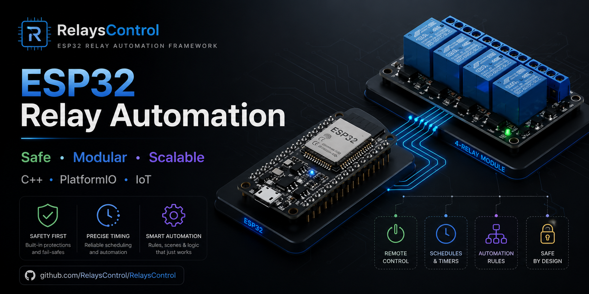
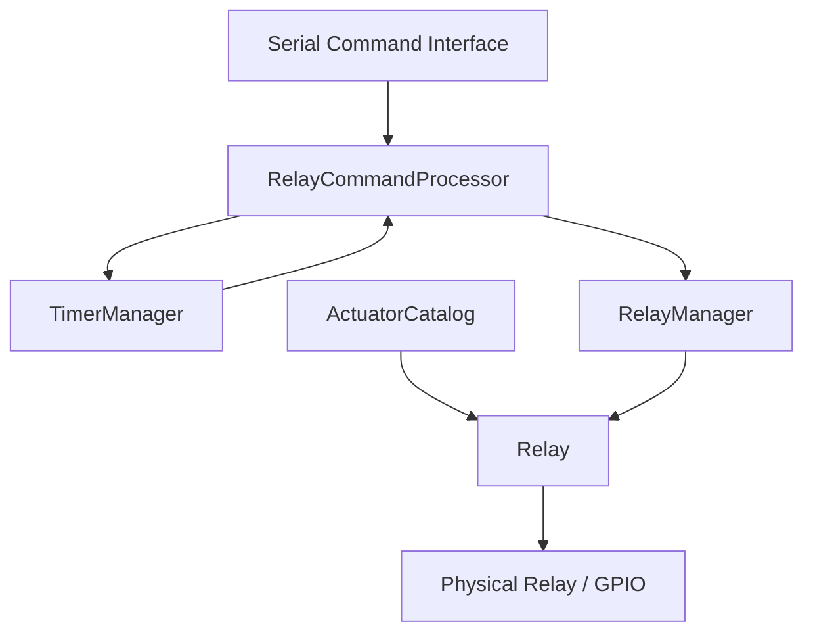

<p align="right">
  <strong>English</strong> | <a href="./README.es.md">Español</a>
</p>

<p align="center">
  
</p>

<div align="center">

# ESP32 Relay Automation

### Modular and safety-oriented relay control system built with C++ and PlatformIO


</div>

---

## Overview

This project implements a modular relay-control subsystem for an **ESP32-based indoor hydroponics automation system**.

The firmware is designed with object-oriented C++ and separates relay behavior, safety rules, timers, command processing, and actuator configuration into independent components. Its purpose is to provide a reliable foundation that can later integrate sensors, schedules, automation rules, persistent configuration, Wi-Fi, and a REST API.

The current implementation controls four actuators:

| ID | Actuator | GPIO |
|---:|---|---:|
| 1 | Water pump | 16 |
| 2 | Extractor fan | 17 |
| 3 | Grow light | 18 |
| 4 | Humidifier | 19 |

---

## Main Features

- Object-oriented relay abstraction
- Centralized relay management
- Safe startup state for all outputs
- Active-low relay support
- Manual ON and OFF commands
- Timed relay activation
- Automatic timer expiration
- Manual relay locking and unlocking
- Minimum OFF-time protection
- Maximum ON-time protection
- Command validation and structured result codes
- Control-source validation
- Serial command interface
- Status reporting for relays and active timers
- Capacity prepared for up to 16 relays

---

## Safety-Oriented Design

The system was designed to avoid direct and uncontrolled GPIO manipulation.

Every command passes through a validation layer before reaching the physical relay. Depending on the actuator configuration, the firmware can reject commands because of:

- Disabled or uninitialized relay
- Active safety lock
- Fault state
- Invalid command source
- Invalid or excessive duration
- Required timed activation
- Minimum OFF time not yet completed
- Existing active timer
- Timer capacity limit

During startup, all registered relays are initialized and moved to their configured safe state before the serial interface becomes available.

> **Electrical safety:** Mechanical relays may switch dangerous voltages. Use proper isolation, protection, grounding, enclosures, and qualified supervision when working with mains electricity.

---

## Architecture



### Main Components

| Component | Responsibility |
|---|---|
| `Relay` | Encapsulates state, GPIO access, locks, safe state, and actuator protections |
| `RelayManager` | Registers relays and provides centralized management |
| `ActuatorCatalog` | Supplies default safety configurations by actuator type |
| `RelayCommandProcessor` | Validates and executes commands from different control sources |
| `TimerManager` | Manages timed activations and automatic shutdown |
| `main.cpp` | Configures actuators and exposes the serial command interface |

---

## Project Structure

```text
RelaysControl/
├── include/
│   ├── automation/
│   │   ├── commands/
│   │   └── timers/
│   ├── core/
│   └── relays/
├── src/
│   ├── automation/
│   │   ├── commands/
│   │   └── timers/
│   ├── relays/
│   └── main.cpp
├── test/
├── platformio.ini
└── README.md
```

---

## Serial Commands

Open the serial monitor at **115200 baud**.

| Command | Description |
|---|---|
| `help` | Displays the command list |
| `status` | Displays relay states and active timers |
| `on <id>` | Turns a relay ON continuously |
| `on <id> <durationMs>` | Turns a relay ON for a specified duration |
| `off <id>` | Turns a relay OFF and cancels its timer |
| `lock <id>` | Locks the relay and forces it OFF |
| `unlock <id>` | Unlocks the relay and keeps it OFF |

### Examples

```text
status
on 1
on 3 10000
off 1
lock 2
unlock 2
```

---

## Requirements

### Hardware

- ESP32 DevKit V1 / ESP-WROOM-32
- Compatible relay module
- Proper external power supply for the relay board and connected loads
- Common ground where electrically appropriate
- Appropriate electrical protections

### Software

- Visual Studio Code
- PlatformIO
- Arduino Framework for ESP32

---

## Build and Upload

Clone the repository:

```bash
git clone https://github.com/Agus-yanez/RelaysControl.git
cd RelaysControl
```

Build the firmware:

```bash
pio run
```

Upload it to the ESP32:

```bash
pio run --target upload
```

Open the serial monitor:

```bash
pio device monitor
```

---

## Roadmap

- [x] Relay abstraction
- [x] Centralized relay manager
- [x] Safe startup states
- [x] Relay locks
- [x] Timed activations
- [x] Serial command processor
- [x] Actuator-specific safety configuration
- [ ] Multiple schedules per relay
- [ ] Scheduling across midnight
- [ ] Sensor-based automation rules
- [ ] Persistent configuration
- [ ] RTC and network time integration
- [ ] Wi-Fi and REST API integration
- [ ] Logging and alerts
- [ ] Automated tests

---

## Project Context

This subsystem is part of a larger project for monitoring and automating an indoor hydroponics environment.

The long-term goal is to connect relay control with:

- Environmental and water-quality sensors
- Configurable schedules
- Automation rules
- Operating modes and cultivation profiles
- Persistent storage
- Remote monitoring
- Backend and dashboard integration

---

## Author

Developed by [Agustín Yañez](https://github.com/Agus-yanez).
